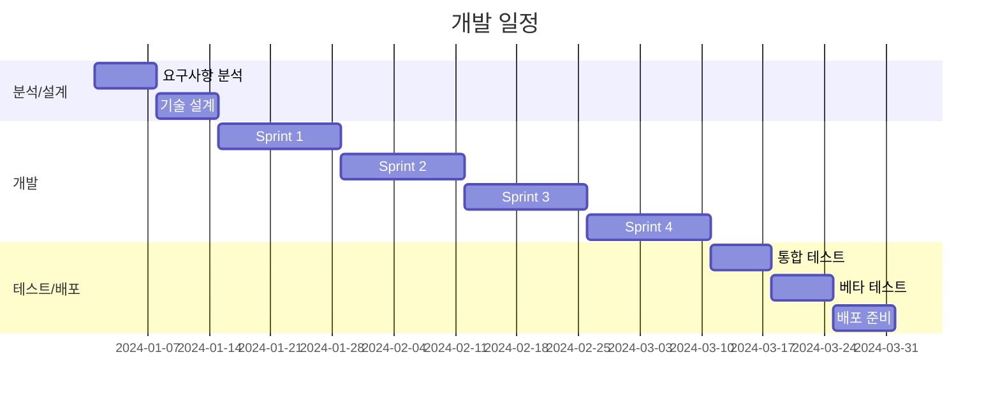

# Product Requirements Document (PRD)

## 문서 정보
- **프로젝트명**: [프로젝트 이름]
- **버전**: v1.0
- **작성일**: YYYY-MM-DD
- **작성자**: [이름/팀]
- **상태**: Draft / Review / Approved / Implemented
- **관련 문서**: 
  - [INIT.md](./INIT.md)
  - [API.md](./API.md)
  - [ARCHITECTURE.md](./ARCHITECTURE.md)

---

## 목차
1. [프로젝트 개요](#1-프로젝트-개요)
2. [사용자 스토리](#2-사용자-스토리)
3. [기능 명세](#3-기능-명세)
4. [데이터 모델](#4-데이터-모델)
5. [API 명세](#5-api-명세)
6. [비기능 요구사항](#6-비기능-요구사항)
7. [UI/UX 요구사항](#7-uiux-요구사항)
8. [기술 스택](#8-기술-스택)
9. [개발 일정](#9-개발-일정)
10. [테스트 계획](#10-테스트-계획)
11. [위험 요소 및 대응](#11-위험-요소-및-대응)

---

## 1. 프로젝트 개요

### 1.1 배경 및 목적

**현재 상황:**
[현재 시스템의 문제점이나 비즈니스 요구사항 설명]

**예시:**
현재 온라인 쇼핑몰은 주문 관리 시스템이 수작업으로 이루어지고 있어 주문 처리 시간이 평균 24시간 소요됩니다. 이로 인해 고객 불만이 증가하고 있으며, 경쟁사 대비 배송 속도가 느려 매출 감소로 이어지고 있습니다.

**프로젝트 목적:**
[이 프로젝트를 통해 달성하고자 하는 목표]

**예시:**
주문 처리 자동화 시스템을 구축하여 주문부터 배송까지의 프로세스를 자동화하고, 처리 시간을 24시간에서 2시간 이내로 단축합니다.

### 1.2 목표 (Goals)

**비즈니스 목표:**
1. 주문 처리 시간 90% 단축 (24시간 → 2시간)
2. 재고 정확도 95% 이상 유지
3. 고객 만족도 20% 향상
4. 월간 주문 처리 용량 3배 증가 (3만 건 → 9만 건)

**기술 목표:**
1. 실시간 재고 동기화 시스템 구축
2. 주문-결제-배송 자동화 파이프라인 구현
3. 확장 가능한 마이크로서비스 아키텍처 적용
4. 99.9% 서비스 가용성 달성

### 1.3 성공 지표 (Success Metrics)

| 지표 | 현재 | 목표 | 측정 방법 |
|------|------|------|-----------|
| 주문 처리 시간 | 24시간 | 2시간 | 주문 접수 → 배송 준비 시간 측정 |
| 시스템 응답 시간 | 3초 | 500ms | API 응답 시간 모니터링 |
| 재고 정확도 | 80% | 95% | 재고 오차 건수 / 전체 주문 건수 |
| 동시 처리 용량 | 100 TPS | 500 TPS | 부하 테스트 |
| 에러율 | 5% | 0.1% | 에러 발생 건수 / 전체 요청 건수 |

### 1.4 범위 (Scope)

**포함 (In Scope):**
- ✅ 주문 생성 및 조회 API
- ✅ 실시간 재고 관리 시스템
- ✅ 결제 연동 (PG사 API)
- ✅ 주문 상태 추적 시스템
- ✅ 관리자 대시보드 (기본 기능)
- ✅ 이메일 알림 (주문 확인, 배송 시작)

**제외 (Out of Scope):**
- ❌ 모바일 앱 개발 (v2.0에서 구현)
- ❌ AI 기반 상품 추천 (v2.0에서 구현)
- ❌ 다국어 지원 (v1.5에서 구현)
- ❌ 소셜 로그인 (OAuth) (v1.5에서 구현)

### 1.5 가정 및 제약사항

**가정 (Assumptions):**
- PG사 API는 안정적으로 동작한다
- 배송 파트너사 API는 실시간으로 정보를 제공한다
- 피크 시간대 동시 접속자는 최대 5,000명이다

**제약사항 (Constraints):**
- 개발 기간: 3개월
- 개발 인력: 백엔드 3명, 프론트엔드 2명
- 예산: 5,000만원
- 레거시 시스템과의 호환성 유지 필요

---

## 2. 사용자 스토리

### 2.1 주요 페르소나

#### 페르소나 1: 고객 (일반 사용자)
- **이름**: 김소비 (28세, 회사원)
- **기술 수준**: 중급
- **사용 환경**: 모바일 (70%), 데스크톱 (30%)
- **목표**: 
  - 빠르고 편리하게 상품을 주문하고 싶다
  - 주문 상태를 실시간으로 확인하고 싶다
  - 안전하게 결제하고 싶다
- **페인 포인트**:
  - 주문 후 처리 상태를 알 수 없어 불안하다
  - 재고가 있다고 표시되었는데 품절이라고 연락받은 경험이 있다
  - 배송이 언제 오는지 알 수 없어 답답하다

#### 페르소나 2: 관리자 (CS 담당자)
- **이름**: 이운영 (32세, 고객센터 팀장)
- **기술 수준**: 중급
- **사용 환경**: 데스크톱
- **목표**:
  - 주문 상태를 빠르게 파악하고 처리하고 싶다
  - 고객 문의에 정확한 정보를 제공하고 싶다
  - 통계 데이터를 쉽게 확인하고 싶다
- **페인 포인트**:
  - 여러 시스템을 오가며 정보를 찾아야 한다
  - 실시간 재고 정보를 확인할 수 없다
  - 주문 오류 처리가 수작업이라 시간이 오래 걸린다

#### 페르소나 3: 개발자 (시스템 관리자)
- **이름**: 박개발 (35세, 백엔드 개발자)
- **기술 수준**: 고급
- **사용 환경**: IDE, 모니터링 대시보드
- **목표**:
  - 시스템을 안정적으로 운영하고 싶다
  - 장애를 빠르게 감지하고 대응하고 싶다
  - 확장 가능한 구조를 유지하고 싶다
- **페인 포인트**:
  - 피크 시간에 시스템이 자주 다운된다
  - 로그가 분산되어 있어 문제 파악이 어렵다
  - 배포 시 다운타임이 발생한다

### 2.2 사용자 시나리오

#### 시나리오 1: 상품 주문하기

```gherkin
Feature: 상품 주문
  As a 고객
  I want to 상품을 주문하고 싶다
  So that 빠르게 상품을 받을 수 있다

Scenario: 정상적인 주문 프로세스
  Given 고객이 로그인되어 있다
  And 장바구니에 상품이 1개 이상 담겨있다
  And 모든 상품의 재고가 충분하다
  When 고객이 주문하기 버튼을 클릭한다
  And 배송지 정보를 입력한다
  And 결제 정보를 입력하고 결제를 완료한다
  Then 주문이 생성된다
  And 재고가 자동으로 차감된다
  And 주문 확인 이메일이 발송된다
  And 주문 상세 페이지로 리다이렉트된다
```

**Acceptance Criteria:**
- [ ] 주문 생성 시 모든 상품의 재고가 충분한지 검증한다
- [ ] 재고가 부족한 경우 주문이 생성되지 않고 에러 메시지를 표시한다
- [ ] 결제 실패 시 주문이 생성되지 않는다
- [ ] 주문 생성과 동시에 재고가 자동으로 차감된다 (트랜잭션)
- [ ] 주문 완료 후 5분 이내에 확인 이메일이 발송된다
- [ ] 주문 번호는 고유하며 추적 가능하다

**예외 처리:**
- 재고 부족: "재고가 부족합니다. 수량을 조정해주세요."
- 결제 실패: "결제에 실패했습니다. 결제 정보를 확인해주세요."
- 배송지 오류: "배송지 정보가 올바르지 않습니다."
- 시스템 오류: "일시적인 오류가 발생했습니다. 잠시 후 다시 시도해주세요."

#### 시나리오 2: 주문 상태 조회

```gherkin
Feature: 주문 상태 조회
  As a 고객
  I want to 내 주문의 현재 상태를 확인하고 싶다
  So that 배송 진행 상황을 알 수 있다

Scenario: 주문 목록 조회
  Given 고객이 로그인되어 있다
  And 고객이 과거에 주문한 이력이 있다
  When 고객이 "내 주문" 페이지에 접속한다
  Then 최근 주문부터 내림차순으로 주문 목록이 표시된다
  And 각 주문의 상태가 표시된다 (주문완료, 결제완료, 배송준비중, 배송중, 배송완료, 취소)
  And 페이징 처리되어 한 페이지에 20개씩 표시된다
```

**Acceptance Criteria:**
- [ ] 본인의 주문만 조회할 수 있다 (타인 주문 조회 불가)
- [ ] 주문 상태는 실시간으로 업데이트된다
- [ ] 주문 번호, 주문일시, 총 금액, 배송지, 상태가 표시된다
- [ ] 주문 상세 버튼을 클릭하면 상세 정보를 확인할 수 있다
- [ ] 취소 가능한 주문은 취소 버튼이 활성화된다

#### 시나리오 3: 주문 취소하기

```gherkin
Feature: 주문 취소
  As a 고객
  I want to 주문을 취소하고 싶다
  So that 불필요한 구매를 막고 환불받을 수 있다

Scenario: 결제 완료 상태에서 주문 취소
  Given 고객이 로그인되어 있다
  And 주문이 "결제완료" 상태이다
  When 고객이 주문 취소 버튼을 클릭한다
  And 취소 사유를 선택한다
  And 취소 확인 버튼을 클릭한다
  Then 주문 상태가 "취소" 상태로 변경된다
  And 재고가 자동으로 복구된다
  And 환불 처리가 시작된다
  And 취소 확인 이메일이 발송된다
```

**Acceptance Criteria:**
- [ ] "배송준비중" 상태 이전까지만 취소가 가능하다
- [ ] "배송준비중" 이후에는 취소 버튼이 비활성화된다
- [ ] 취소 시 재고가 자동으로 복구된다 (트랜잭션)
- [ ] 환불은 결제 수단에 따라 3-7일 소요됨을 안내한다
- [ ] 취소 완료 후 5분 이내에 확인 이메일이 발송된다

---

## 3. 기능 명세

### 3.1 기능 목록

| 번호 | 기능명 | 우선순위 | 버전 | 담당자 | 상태 |
|------|--------|----------|------|--------|------|
| F-001 | 회원가입/로그인 | High | v1.0 | 홍길동 | ✅ 완료 |
| F-002 | 상품 목록 조회 | High | v1.0 | 홍길동 | ✅ 완료 |
| F-003 | 상품 상세 조회 | High | v1.0 | 홍길동 | ✅ 완료 |
| F-004 | 장바구니 관리 | High | v1.0 | 김철수 | 🚧 진행중 |
| F-005 | 주문 생성 | High | v1.0 | 김철수 | 🚧 진행중 |
| F-006 | 주문 조회 | High | v1.0 | 김철수 | 📅 예정 |
| F-007 | 주문 취소 | High | v1.0 | 김철수 | 📅 예정 |
| F-008 | 결제 연동 | High | v1.0 | 이영희 | 📅 예정 |
| F-009 | 재고 관리 | High | v1.0 | 이영희 | 📅 예정 |
| F-010 | 이메일 알림 | Medium | v1.0 | 박민수 | 📅 예정 |
| F-011 | 관리자 대시보드 | Medium | v1.0 | 박민수 | 📅 예정 |
| F-012 | 주문 통계 | Low | v1.1 | - | ⏸️ 보류 |

### 3.2 상세 명세

#### F-005: 주문 생성

**설명:**
고객이 장바구니에 담긴 상품을 주문하고 결제를 완료하여 주문을 생성합니다.

**비즈니스 로직:**

```java
/**
 * 주문 생성 프로세스
 * 
 * 1. 요청 검증
 *    - 사용자 인증 확인
 *    - 장바구니 존재 여부 확인
 *    - 배송지 정보 유효성 검증
 * 
 * 2. 재고 확인 및 차감
 *    - 모든 상품의 재고 충분 여부 확인
 *    - 재고 차감 (Pessimistic Lock)
 *    - 재고 부족 시 예외 발생
 * 
 * 3. 주문 생성
 *    - 주문 엔티티 생성
 *    - 주문 상품 엔티티 생성 (주문-상품 관계)
 *    - 총 금액 계산 (상품 금액 + 배송비)
 *    - 주문 번호 생성 (예: ORD20240101-000001)
 * 
 * 4. 결제 처리
 *    - PG사 API 호출
 *    - 결제 성공 시 주문 상태 변경 (PENDING → PAID)
 *    - 결제 실패 시 재고 복구 및 주문 삭제
 * 
 * 5. 후속 처리
 *    - 장바구니 비우기
 *    - 이메일 알림 발송 (비동기)
 *    - 주문 이벤트 발행 (배송 시스템 연동용)
 * 
 * 모든 과정은 단일 트랜잭션으로 처리됩니다.
 */
```

**입력 (OrderCreateRequest):**
```java
@Getter
@NoArgsConstructor
public class OrderCreateRequest {
    
    @NotNull(message = "장바구니 ID는 필수입니다.")
    private Long cartId;
    
    @NotNull(message = "배송지 정보는 필수입니다.")
    @Valid
    private DeliveryAddressRequest deliveryAddress;
    
    @NotNull(message = "결제 정보는 필수입니다.")
    @Valid
    private PaymentRequest payment;
    
    private String orderMemo; // 배송 메모 (선택)
}

@Getter
@NoArgsConstructor
public class DeliveryAddressRequest {
    
    @NotBlank(message = "받는 사람 이름은 필수입니다.")
    @Size(min = 2, max = 50)
    private String recipientName;
    
    @NotBlank(message = "연락처는 필수입니다.")
    @Pattern(regexp = "^01[0-9]-[0-9]{3,4}-[0-9]{4}$")
    private String phoneNumber;
    
    @NotBlank(message = "우편번호는 필수입니다.")
    @Pattern(regexp = "^[0-9]{5}$")
    private String zipCode;
    
    @NotBlank(message = "기본 주소는 필수입니다.")
    private String address;
    
    @NotBlank(message = "상세 주소는 필수입니다.")
    private String detailAddress;
}

@Getter
@NoArgsConstructor
public class PaymentRequest {
    
    @NotNull(message = "결제 수단은 필수입니다.")
    private PaymentMethod paymentMethod; // CARD, BANK_TRANSFER, VIRTUAL_ACCOUNT
    
    // 카드 결제 시
    private String cardNumber;
    private String expiryDate;
    private String cvv;
    
    // 가상계좌 시
    private String bankCode;
}
```

**출력 (OrderResponse):**
```java
@Getter
@Builder
public class OrderResponse {
    private Long id;
    private String orderNumber;
    private OrderStatus status;
    private Long totalAmount;
    private Long deliveryFee;
    private Long finalAmount;
    private DeliveryAddressResponse deliveryAddress;
    private List<OrderItemResponse> items;
    private LocalDateTime orderedAt;
    private LocalDateTime estimatedDeliveryDate;
}

@Getter
@Builder
public class OrderItemResponse {
    private Long productId;
    private String productName;
    private Long price;
    private Integer quantity;
    private Long totalPrice;
}
```

**예외 처리:**

| 상황 | 예외 타입 | HTTP Status | 에러 코드 | 메시지 |
|------|-----------|-------------|-----------|--------|
| 장바구니 없음 | BusinessException | 404 | CART_NOT_FOUND | 장바구니를 찾을 수 없습니다. |
| 재고 부족 | BusinessException | 409 | OUT_OF_STOCK | 재고가 부족합니다. |
| 결제 실패 | BusinessException | 400 | PAYMENT_FAILED | 결제에 실패했습니다. |
| 배송지 오류 | BusinessException | 400 | INVALID_ADDRESS | 올바르지 않은 배송지 정보입니다. |
| PG사 응답 타임아웃 | BusinessException | 504 | PAYMENT_TIMEOUT | 결제 처리 중 오류가 발생했습니다. |

**제약 조건:**
- 동시에 같은 상품을 주문하는 경우 재고 부족 방지 (Pessimistic Lock)
- 주문 생성부터 결제 완료까지 최대 10분 (이후 자동 취소)
- 최소 주문 금액: 10,000원
- 최대 주문 금액: 10,000,000원
- 배송비: 30,000원 이상 무료, 미만 3,000원

**성능 요구사항:**
- 응답 시간: 평균 1초 이내, 최대 3초
- 동시 주문 처리: 초당 100건 이상

**보안 요구사항:**
- 본인의 장바구니로만 주문 가능 (userId 검증)
- 결제 정보는 암호화하여 전송 (TLS 1.3)
- 카드 정보는 DB에 저장하지 않음 (PG사에서 관리)
- JWT 토큰 검증 필수

---

## 4. 데이터 모델

### 4.1 ERD (Entity Relationship Diagram)

```
┌─────────────┐       ┌──────────────┐       ┌─────────────┐
│    User     │       │    Order     │       │   Product   │
├─────────────┤       ├──────────────┤       ├─────────────┤
│ id (PK)     │──────<│ user_id (FK) │       │ id (PK)     │
│ email       │       │ order_number │       │ name        │
│ password    │       │ status       │       │ price       │
│ name        │       │ total_amount │       │ stock       │
│ phone       │       │ delivery_fee │       │ description │
│ role        │       │ final_amount │       │ category_id │
│ created_at  │       │ ordered_at   │       │ created_at  │
│ updated_at  │       │ created_at   │       │ updated_at  │
└─────────────┘       │ updated_at   │       └─────────────┘
                      └──────────────┘              │
                             │                      │
                             │                      │
                      ┌──────▼──────────┐           │
                      │   OrderItem     │           │
                      ├─────────────────┤           │
                      │ id (PK)         │           │
                      │ order_id (FK)   │───────────┘
                      │ product_id (FK) │
                      │ price           │
                      │ quantity        │
                      │ total_price     │
                      └─────────────────┘

┌─────────────┐       ┌──────────────┐
│    Cart     │       │   CartItem   │
├─────────────┤       ├──────────────┤
│ id (PK)     │──────<│ cart_id (FK) │
│ user_id (FK)│       │ product_id   │
│ created_at  │       │ quantity     │
│ updated_at  │       │ created_at   │
└─────────────┘       └──────────────┘

┌──────────────────┐       ┌─────────────┐
│ DeliveryAddress  │       │   Payment   │
├──────────────────┤       ├─────────────┤
│ id (PK)          │       │ id (PK)     │
│ order_id (FK)    │       │ order_id    │
│ recipient_name   │       │ method      │
│ phone_number     │       │ amount      │
│ zip_code         │       │ status      │
│ address          │       │ pg_tid      │
│ detail_address   │       │ paid_at     │
└──────────────────┘       └─────────────┘
```

### 4.2 엔티티 정의

#### User (사용자)
```java
@Entity
@Table(name = "users")
@Getter
@NoArgsConstructor(access = AccessLevel.PROTECTED)
@EntityListeners(AuditingEntityListener.class)
public class User {
    
    @Id
    @GeneratedValue(strategy = GenerationType.IDENTITY)
    private Long id;
    
    @Column(nullable = false, unique = true, length = 100)
    private String email;
    
    @Column(nullable = false)
    private String password;
    
    @Column(nullable = false, length = 50)
    private String name;
    
    @Column(length = 20)
    private String phone;
    
    @Enumerated(EnumType.STRING)
    @Column(nullable = false, length = 20)
    private UserRole role; // USER, ADMIN
    
    @CreatedDate
    @Column(nullable = false, updatable = false)
    private LocalDateTime createdAt;
    
    @LastModifiedDate
    @Column(nullable = false)
    private LocalDateTime updatedAt;
    
    @OneToMany(mappedBy = "user", cascade = CascadeType.ALL)
    private List<Order> orders = new ArrayList<>();
    
    @Builder
    public User(String email, String password, String name, String phone, UserRole role) {
        this.email = email;
        this.password = password;
        this.name = name;
        this.phone = phone;
        this.role = role != null ? role : UserRole.USER;
    }
}
```

#### Order (주문)
```java
@Entity
@Table(name = "orders")
@Getter
@NoArgsConstructor(access = AccessLevel.PROTECTED)
@EntityListeners(AuditingEntityListener.class)
public class Order {
    
    @Id
    @GeneratedValue(strategy = GenerationType.IDENTITY)
    private Long id;
    
    @Column(nullable = false, unique = true, length = 50)
    private String orderNumber;
    
    @ManyToOne(fetch = FetchType.LAZY)
    @JoinColumn(name = "user_id", nullable = false)
    private User user;
    
    @Enumerated(EnumType.STRING)
    @Column(nullable = false, length = 20)
    private OrderStatus status; // PENDING, PAID, PREPARING, SHIPPING, DELIVERED, CANCELLED
    
    @Column(nullable = false)
    private Long totalAmount; // 상품 총액
    
    @Column(nullable = false)
    private Long deliveryFee; // 배송비
    
    @Column(nullable = false)
    private Long finalAmount; // 최종 결제 금액
    
    @Column(length = 500)
    private String orderMemo;
    
    @Column(nullable = false)
    private LocalDateTime orderedAt;
    
    private LocalDateTime estimatedDeliveryDate;
    
    @CreatedDate
    @Column(nullable = false, updatable = false)
    private LocalDateTime createdAt;
    
    @LastModifiedDate
    @Column(nullable = false)
    private LocalDateTime updatedAt;
    
    @OneToMany(mappedBy = "order", cascade = CascadeType.ALL, orphanRemoval = true)
    private List<OrderItem> orderItems = new ArrayList<>();
    
    @OneToOne(mappedBy = "order", cascade = CascadeType.ALL, orphanRemoval = true)
    private DeliveryAddress deliveryAddress;
    
    @OneToOne(mappedBy = "order", cascade = CascadeType.ALL, orphanRemoval = true)
    private Payment payment;
    
    @Builder
    public Order(User user, String orderNumber, Long totalAmount, Long deliveryFee, 
                 String orderMemo, LocalDateTime orderedAt) {
        this.user = user;
        this.orderNumber = orderNumber;
        this.status = OrderStatus.PENDING;
        this.totalAmount = totalAmount;
        this.deliveryFee = deliveryFee;
        this.finalAmount = totalAmount + deliveryFee;
        this.orderMemo = orderMemo;
        this.orderedAt = orderedAt;
        this.estimatedDeliveryDate = orderedAt.plusDays(3);
    }
    
    // 비즈니스 로직
    public void markAsPaid() {
        if (this.status != OrderStatus.PENDING) {
            throw new BusinessException(ErrorCode.INVALID_ORDER_STATUS);
        }
        this.status = OrderStatus.PAID;
    }
    
    public void cancel() {
        if (this.status == OrderStatus.SHIPPING || this.status == OrderStatus.DELIVERED) {
            throw new BusinessException(ErrorCode.CANNOT_CANCEL_ORDER);
        }
        this.status = OrderStatus.CANCELLED;
    }
    
    public void startShipping() {
        if (this.status != OrderStatus.PREPARING) {
            throw new BusinessException(ErrorCode.INVALID_ORDER_STATUS);
        }
        this.status = OrderStatus.SHIPPING;
    }
    
    public void completeDelivery() {
        if (this.status != OrderStatus.SHIPPING) {
            throw new BusinessException(ErrorCode.INVALID_ORDER_STATUS);
        }
        this.status = OrderStatus.DELIVERED;
    }
}

public enum OrderStatus {
    PENDING,      // 주문 생성됨
    PAID,         // 결제 완료
    PREPARING,    // 배송 준비중
    SHIPPING,     // 배송중
    DELIVERED,    // 배송 완료
    CANCELLED     // 주문 취소
}
```

#### Product (상품)
```java
@Entity
@Table(name = "products")
@Getter
@NoArgsConstructor(access = AccessLevel.PROTECTED)
@EntityListeners(AuditingEntityListener.class)
public class Product {
    
    @Id
    @GeneratedValue(strategy = GenerationType.IDENTITY)
    private Long id;
    
    @Column(nullable = false, length = 200)
    private String name;
    
    @Column(nullable = false)
    private Long price;
    
    @Column(nullable = false)
    private Integer stock;
    
    @Column(columnDefinition = "TEXT")
    private String description;
    
    @Column(length = 500)
    private String imageUrl;
    
    @ManyToOne(fetch = FetchType.LAZY)
    @JoinColumn(name = "category_id")
    private Category category;
    
    @Enumerated(EnumType.STRING)
    @Column(nullable = false, length = 20)
    private ProductStatus status; // ACTIVE, INACTIVE, OUT_OF_STOCK
    
    @CreatedDate
    @Column(nullable = false, updatable = false)
    private LocalDateTime createdAt;
    
    @LastModifiedDate
    @Column(nullable = false)
    private LocalDateTime updatedAt;
    
    @Builder
    public Product(String name, Long price, Integer stock, String description, 
                   String imageUrl, Category category) {
        this.name = name;
        this.price = price;
        this.stock = stock;
        this.description = description;
        this.imageUrl = imageUrl;
        this.category = category;
        this.status = ProductStatus.ACTIVE;
    }
    
    // 비즈니스 로직
    public void decreaseStock(int quantity) {
        if (this.stock < quantity) {
            throw new BusinessException(ErrorCode.OUT_OF_STOCK);
        }
        this.stock -= quantity;
        
        if (this.stock == 0) {
            this.status = ProductStatus.OUT_OF_STOCK;
        }
    }
    
    public void increaseStock(int quantity) {
        this.stock += quantity;
        
        if (this.stock > 0 && this.status == ProductStatus.OUT_OF_STOCK) {
            this.status = ProductStatus.ACTIVE;
        }
    }
}
```

#### OrderItem (주문 상품)
```java
@Entity
@Table(name = "order_items")
@Getter
@NoArgsConstructor(access = AccessLevel.PROTECTED)
public class OrderItem {
    
    @Id
    @GeneratedValue(strategy = GenerationType.IDENTITY)
    private Long id;
    
    @ManyToOne(fetch = FetchType.LAZY)
    @JoinColumn(name = "order_id", nullable = false)
    private Order order;
    
    @ManyToOne(fetch = FetchType.LAZY)
    @JoinColumn(name = "product_id", nullable = false)
    private Product product;
    
    @Column(nullable = false)
    private Long price; // 주문 당시 가격 (가격 변동 대비)
    
    @Column(nullable = false)
    private Integer quantity;
    
    @Column(nullable = false)
    private Long totalPrice;
    
    @Builder
    public OrderItem(Order order, Product product, Integer quantity) {
        this.order = order;
        this.product = product;
        this.price = product.getPrice();
        this.quantity = quantity;
        this.totalPrice = this.price * quantity;
    }
}
```

### 4.3 인덱스 전략

```sql
-- users 테이블
CREATE INDEX idx_users_email ON users(email);
CREATE INDEX idx_users_created_at ON users(created_at);

-- orders 테이블
CREATE INDEX idx_orders_user_id ON orders(user_id);
CREATE INDEX idx_orders_status ON orders(status);
CREATE INDEX idx_orders_order_number ON orders(order_number);
CREATE INDEX idx_orders_ordered_at ON orders(ordered_at);
CREATE INDEX idx_orders_user_status ON orders(user_id, status);

-- products 테이블
CREATE INDEX idx_products_category_id ON products(category_id);
CREATE INDEX idx_products_status ON products(status);
CREATE INDEX idx_products_name ON products(name);
CREATE INDEX idx_products_price ON products(price);

-- order_items 테이블
CREATE INDEX idx_order_items_order_id ON order_items(order_id);
CREATE INDEX idx_order_items_product_id ON order_items(product_id);
```

---

## 5. API 명세

### 5.1 공통 사항

**Base URL:**
```
개발: http://localhost:8080/api/v1
스테이징: https://staging-api.example.com/api/v1
운영: https://api.example.com/api/v1
```

**인증:**
```
Authorization: Bearer {JWT_TOKEN}
```

**공통 응답 형식:**
```json
{
  "success": true,
  "data": { ... },
  "message": "성공 메시지",
  "timestamp": "2024-01-15T10:30:00"
}
```

**에러 응답 형식:**
```json
{
  "success": false,
  "errorCode": "ERROR_CODE",
  "message": "에러 메시지",
  "timestamp": "2024-01-15T10:30:00"
}
```

### 5.2 주문 API

#### POST /orders - 주문 생성

**Request:**
```http
POST /api/v1/orders
Authorization: Bearer {JWT_TOKEN}
Content-Type: application/json

{
  "cartId": 123,
  "deliveryAddress": {
    "recipientName": "홍길동",
    "phoneNumber": "010-1234-5678",
    "zipCode": "12345",
    "address": "서울시 강남구 테헤란로 123",
    "detailAddress": "ABC빌딩 10층"
  },
  "payment": {
    "paymentMethod": "CARD",
    "cardNumber": "1234-5678-9012-3456",
    "expiryDate": "12/25",
    "cvv": "123"
  },
  "orderMemo": "문 앞에 놔주세요"
}
```

**Response: 201 Created**
```json
{
  "success": true,
  "data": {
    "id": 1,
    "orderNumber": "ORD20240115-000001",
    "status": "PAID",
    "totalAmount": 50000,
    "deliveryFee": 3000,
    "finalAmount": 53000,
    "deliveryAddress": {
      "recipientName": "홍길동",
      "phoneNumber": "010-1234-5678",
      "zipCode": "12345",
      "address": "서울시 강남구 테헤란로 123",
      "detailAddress": "ABC빌딩 10층"
    },
    "items": [
      {
        "productId": 1,
        "productName": "노트북",
        "price": 50000,
        "quantity": 1,
        "totalPrice": 50000
      }
    ],
    "orderedAt": "2024-01-15T10:30:00",
    "estimatedDeliveryDate": "2024-01-18T10:30:00"
  },
  "message": "주문이 완료되었습니다.",
  "timestamp": "2024-01-15T10:30:00"
}
```

**Error Response:**
```json
{
  "success": false,
  "errorCode": "OUT_OF_STOCK",
  "message": "재고가 부족합니다.",
  "data": {
    "productId": 1,
    "productName": "노트북",
    "requestedQuantity": 5,
    "availableStock": 2
  },
  "timestamp": "2024-01-15T10:30:00"
}
```

#### GET /orders - 주문 목록 조회

**Request:**
```http
GET /api/v1/orders?page=0&size=20&sort=orderedAt,desc&status=PAID
Authorization: Bearer {JWT_TOKEN}
```

**Query Parameters:**
- `page`: 페이지 번호 (0부터 시작, default: 0)
- `size`: 페이지 크기 (default: 20, max: 100)
- `sort`: 정렬 기준 (default: orderedAt,desc)
- `status`: 주문 상태 필터 (선택)

**Response: 200 OK**
```json
{
  "success": true,
  "data": [
    {
      "id": 1,
      "orderNumber": "ORD20240115-000001",
      "status": "PAID",
      "finalAmount": 53000,
      "orderedAt": "2024-01-15T10:30:00",
      "itemCount": 1
    }
  ],
  "meta": {
    "page": 0,
    "size": 20,
    "totalElements": 45,
    "totalPages": 3
  },
  "timestamp": "2024-01-15T10:30:00"
}
```

#### GET /orders/{id} - 주문 상세 조회

**Request:**
```http
GET /api/v1/orders/1
Authorization: Bearer {JWT_TOKEN}
```

**Response: 200 OK**
```json
{
  "success": true,
  "data": {
    "id": 1,
    "orderNumber": "ORD20240115-000001",
    "status": "SHIPPING",
    "totalAmount": 50000,
    "deliveryFee": 3000,
    "finalAmount": 53000,
    "deliveryAddress": {
      "recipientName": "홍길동",
      "phoneNumber": "010-1234-5678",
      "zipCode": "12345",
      "address": "서울시 강남구 테헤란로 123",
      "detailAddress": "ABC빌딩 10층"
    },
    "items": [
      {
        "productId": 1,
        "productName": "노트북",
        "price": 50000,
        "quantity": 1,
        "totalPrice": 50000
      }
    ],
    "payment": {
      "method": "CARD",
      "amount": 53000,
      "status": "COMPLETED",
      "paidAt": "2024-01-15T10:30:05"
    },
    "orderedAt": "2024-01-15T10:30:00",
    "estimatedDeliveryDate": "2024-01-18T10:30:00"
  },
  "timestamp": "2024-01-15T10:30:00"
}
```

#### DELETE /orders/{id} - 주문 취소

**Request:**
```http
DELETE /api/v1/orders/1
Authorization: Bearer {JWT_TOKEN}
Content-Type: application/json

{
  "cancelReason": "단순 변심"
}
```

**Response: 200 OK**
```json
{
  "success": true,
  "data": {
    "id": 1,
    "orderNumber": "ORD20240115-000001",
    "status": "CANCELLED",
    "cancelledAt": "2024-01-15T11:00:00"
  },
  "message": "주문이 취소되었습니다. 환불은 3-7일 소요됩니다.",
  "timestamp": "2024-01-15T11:00:00"
}
```

### 5.3 상품 API

#### GET /products - 상품 목록 조회

**Request:**
```http
GET /api/v1/products?page=0&size=20&categoryId=1&sort=price,asc
```

**Response: 200 OK**
```json
{
  "success": true,
  "data": [
    {
      "id": 1,
      "name": "노트북",
      "price": 50000,
      "stock": 10,
      "imageUrl": "https://example.com/images/laptop.jpg",
      "category": {
        "id": 1,
        "name": "전자제품"
      },
      "status": "ACTIVE"
    }
  ],
  "meta": {
    "page": 0,
    "size": 20,
    "totalElements": 100,
    "totalPages": 5
  },
  "timestamp": "2024-01-15T10:30:00"
}
```

---

## 6. 비기능 요구사항

### 6.1 성능 (Performance)

| 항목 | 목표 | 측정 방법 |
|------|------|-----------|
| API 응답 시간 | 평균 500ms 이하 | APM 모니터링 |
| 페이지 로딩 시간 | 3초 이내 | Lighthouse |
| 동시 처리 용량 | 500 TPS | JMeter 부하 테스트 |
| DB 쿼리 시간 | 평균 100ms 이하 | Slow Query Log |
| 캐시 히트율 | 80% 이상 | Redis 모니터링 |

### 6.2 확장성 (Scalability)

- **수평 확장**: 
  - WAS 서버 Auto Scaling (CPU 70% 기준)
  - 최소 인스턴스: 2개
  - 최대 인스턴스: 10개
  
- **데이터베이스**:
  - Read Replica 구성 (Master 1, Slave 2)
  - Connection Pool: HikariCP (최소 10, 최대 50)
  
- **캐싱 전략**:
  - Redis Cluster (3 Master, 3 Slave)
  - 상품 정보: TTL 1시간
  - 재고 정보: TTL 5분

### 6.3 가용성 (Availability)

- **목표**: 99.9% (월 43분 다운타임 허용)
- **무중단 배포**: Blue-Green Deployment
- **헬스체크**: `/actuator/health` (10초 간격)
- **장애 대응**:
  - Circuit Breaker (Resilience4j)
  - PG사 API 타임아웃: 10초
  - 재시도: 최대 3회

### 6.4 보안 (Security)

- **인증/인가**:
  - JWT 기반 인증
  - Access Token: 15분
  - Refresh Token: 7일
  - Role 기반 권한 관리 (RBAC)
  
- **데이터 보호**:
  - 비밀번호: BCrypt (strength 10)
  - 개인정보: AES-256 암호화
  - 통신: TLS 1.3
  
- **보안 헤더**:
  - X-Content-Type-Options: nosniff
  - X-Frame-Options: DENY
  - Content-Security-Policy 설정
  
- **Rate Limiting**:
  - 로그인: 5회/분
  - 주문 생성: 10회/분
  - 일반 API: 100회/분

### 6.5 모니터링 (Monitoring)

- **APM**: Pinpoint / New Relic
- **로그**: ELK Stack (Elasticsearch, Logstash, Kibana)
- **메트릭**: Prometheus + Grafana
- **알림**: Slack, Email
- **로그 레벨**:
  - 운영: INFO
  - 개발: DEBUG

---

## 7. UI/UX 요구사항

### 7.1 반응형 디자인
- 모바일 우선 (Mobile First)
- 브레이크포인트:
  - Mobile: < 768px
  - Tablet: 768px ~ 1024px
  - Desktop: > 1024px

### 7.2 접근성 (Accessibility)
- WCAG 2.1 Level AA 준수
- 키보드 네비게이션 지원
- 스크린 리더 호환
- 명도 대비 4.5:1 이상

### 7.3 사용자 경험
- 로딩 스피너: 1초 이상 소요 시 표시
- 에러 메시지: 명확하고 실행 가능한 안내
- 성공 피드백: Toast 메시지 (3초)
- 폼 검증: 실시간 피드백

---

## 8. 기술 스택

### 8.1 Backend
```yaml
Language: Java 17
Framework: Spring Boot 3.2.x
Build: Gradle 8.x (Kotlin DSL)
Database: PostgreSQL 16.x
Cache: Redis 7.x
Message Queue: RabbitMQ 3.12.x
Testing: JUnit 5, Mockito, TestContainers
```

### 8.2 Infrastructure
```yaml
Container: Docker
Orchestration: Kubernetes
CI/CD: GitHub Actions
Monitoring: Prometheus, Grafana, ELK
Cloud: AWS (EC2, RDS, ElastiCache, S3)
```

---

## 9. 개발 일정

### 9.1 마일스톤

| 단계 | 기간 | 산출물 |
|------|------|--------|
| 요구사항 분석 | 1주 | PRD, 기술 설계서 |
| 개발 환경 구축 | 1주 | CI/CD, 인프라 |
| Sprint 1 | 2주 | 사용자, 상품 API |
| Sprint 2 | 2주 | 장바구니, 주문 API |
| Sprint 3 | 2주 | 결제 연동, 재고 관리 |
| Sprint 4 | 2주 | 관리자, 알림 |
| 통합 테스트 | 1주 | 테스트 리포트 |
| 베타 테스트 | 1주 | 버그 리스트 |
| 배포 준비 | 1주 | 운영 매뉴얼 |

**총 기간: 13주 (약 3개월)**

### 9.2 상세 일정



---

## 10. 테스트 계획

### 10.1 테스트 전략

| 테스트 유형 | 범위 | 목표 커버리지 | 도구 |
|-------------|------|---------------|------|
| 단위 테스트 | Service, Repository | 80% | JUnit 5, Mockito |
| 통합 테스트 | API, DB | 70% | MockMvc, TestContainers |
| E2E 테스트 | 사용자 시나리오 | 주요 플로우 | Selenium, RestAssured |
| 성능 테스트 | 부하, 스트레스 | - | JMeter, Gatling |
| 보안 테스트 | 취약점 검사 | - | OWASP ZAP |

### 10.2 주요 테스트 시나리오

#### TC-001: 주문 생성 성공
```gherkin
Given 사용자가 로그인되어 있다
And 장바구니에 상품이 1개 이상 있다
And 모든 상품의 재고가 충분하다
When 주문 생성 API를 호출한다
Then 주문이 생성된다
And 재고가 차감된다
And 이메일이 발송된다
```

#### TC-002: 재고 부족 시 주문 실패
```gherkin
Given 사용자가 로그인되어 있다
And 장바구니에 상품이 있다
And 상품의 재고가 부족하다
When 주문 생성 API를 호출한다
Then 주문이 생성되지 않는다
And 에러 메시지가 반환된다 "재고가 부족합니다"
```

---

## 11. 위험 요소 및 대응

| 위험 | 영향도 | 확률 | 대응 방안 | 담당자 |
|------|--------|------|-----------|--------|
| PG사 API 불안정 | High | Medium | Circuit Breaker, 재시도 로직, 대체 PG사 | 이영희 |
| 동시성 이슈 (재고) | High | High | Pessimistic Lock, 분산 락 | 김철수 |
| 피크 타임 성능 저하 | Medium | High | 캐싱, Auto Scaling, CDN | 박민수 |
| 개인정보 유출 | High | Low | 암호화, 접근 제어, 감사 로그 | 보안팀 |
| 레거시 연동 실패 | Medium | Medium | 어댑터 패턴, 페일오버 | 홍길동 |

---

## 12. 향후 계획 (Roadmap)

### v1.1 (3개월 후)
- [ ] 소셜 로그인 (Google, Naver, Kakao)
- [ ] 다국어 지원 (영어, 중국어)
- [ ] 쿠폰 및 할인 시스템
- [ ] 주문 통계 대시보드

### v1.5 (6개월 후)
- [ ] 모바일 앱 (iOS, Android)
- [ ] 실시간 채팅 상담
- [ ] 상품 리뷰 시스템
- [ ] 위시리스트

### v2.0 (12개월 후)
- [ ] AI 기반 상품 추천
- [ ] 구독 서비스
- [ ] 포인트 시스템
- [ ] 파트너사 API 개방

---

## 부록

### A. 용어 정의 (Glossary)

| 용어 | 정의 |
|------|------|
| TPS | Transactions Per Second, 초당 트랜잭션 수 |
| PG | Payment Gateway, 전자 결제 대행사 |
| SKU | Stock Keeping Unit, 재고 관리 단위 |
| WAS | Web Application Server |
| APM | Application Performance Monitoring |

### B. 참고 문서

- [Spring Boot 공식 문서](https://spring.io/projects/spring-boot)
- [JPA Best Practices](https://docs.jboss.org/hibernate/orm/current/userguide/html_single/Hibernate_User_Guide.html)
- [RESTful API 설계 가이드](https://restfulapi.net/)
- [AWS 아키텍처 베스트 프랙티스](https://aws.amazon.com/architecture/)

### C. 변경 이력

| 버전 | 날짜 | 변경 내용 | 작성자 |
|------|------|-----------|--------|
| 1.0 | 2024-01-01 | 초기 작성 | 홍길동 |
| 1.1 | 2024-01-15 | 성능 요구사항 추가 | 김철수 |
| 1.2 | 2024-02-01 | API 명세 상세화 | 이영희 |

---

## 승인

- [ ] Product Owner: _______________  (날짜: _______)
- [ ] Tech Lead: _______________  (날짜: _______)
- [ ] UX Designer: _______________  (날짜: _______)
- [ ] QA Lead: _______________  (날짜: _______)

---

**문서 작성 완료일**: 2024-01-15
**다음 리뷰 예정일**: 2024-02-01
